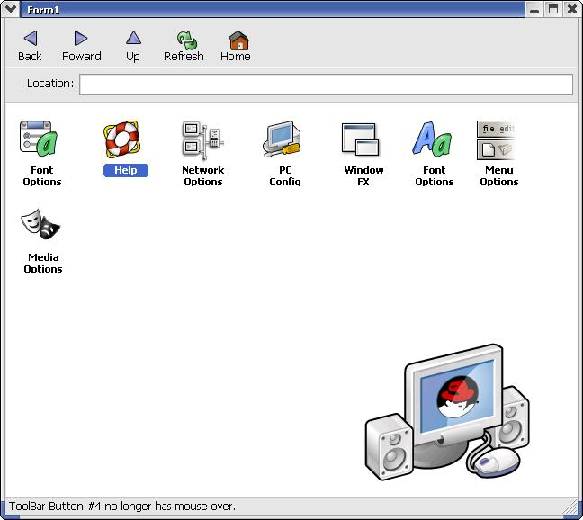



## RedHat Window

### Description

I wrote this to use along with my RedHat shell. It isnt quite done yet. Ive basicly subclassed everything with OnMouseOver and OnMouseLeave abilities. The form will resize without a Timer, API only. Doesnt seem to respond well with slower machine when resizing. Tell me what you think. This program has no purpose, just basicly EyeCandy.
 
### More Info
 

             |
---                |---
**Submitted On**   |2005-02-08 21:30:32
**By**             |[Eric Wolcott](https://github.com/Planet-Source-Code/PSCIndex/blob/master/ByAuthor/eric-wolcott.md)
**Level**          |Advanced
**User Rating**    |4.8 (29 globes from 6 users)
**Compatibility**  |VB 4\.0 \(16\-bit\), VB 4\.0 \(32\-bit\), VB 5\.0, VB 6\.0
**Category**       |[Custom Controls/ Forms/  Menus](https://github.com/Planet-Source-Code/PSCIndex/blob/master/ByCategory/custom-controls-forms-menus__1-4.md)
**World**          |[Visual Basic](https://github.com/Planet-Source-Code/PSCIndex/blob/master/ByWorld/visual-basic.md)
**Archive File**   |[RedHat\_Win185020282005\.zip](https://github.com/Planet-Source-Code/eric-wolcott-redhat-window__1-58794/archive/master.zip)

